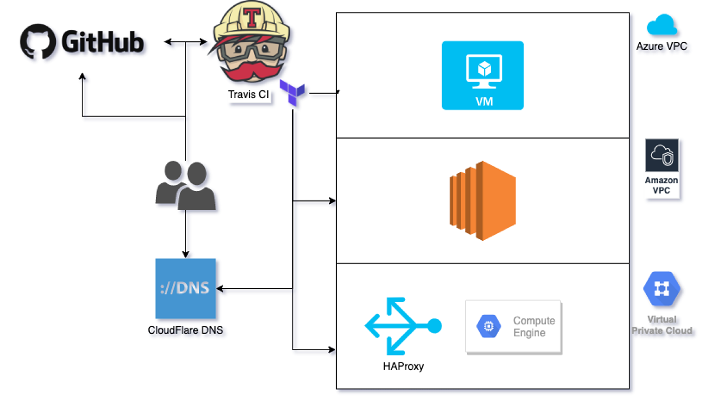

# Multi-Cloud (AWS, Azure and GCP) IaC with Terraform empowered with Terragrunt
[](https://travis-ci.com/DovnarAlexander/)
## Diagram

## Prerequisites
### External
* AWS Account and generated programmatic credentials.
* GCP Account and generated programmatic credentials.
* Azure Account and generated programmatic credentials.
* CloudFlare account, domain and generated API Token.
### Environment
* Python3
* Terraform 12 (https://www.terraform.io/downloads.html)
* Terragrunt (https://github.com/gruntwork-io/terragrunt/releases)
## Preparation
1. Export all programmatic credentials for all clouds \ systems to your environment.
2. Install dependencies with python pip:
```bash
pip install -r requirements.txt
```
## Usage
### Generate \ update the target environment
1. New environment creation
```bash
cookiecutter .generator/
```
2. Existing environment update
```bash
ENV=preprod
cookiecutter .generator/ -f --config-file $ENV/.cookiecutter.yaml
```
### Apply core stack (or any other)
```bash
ENV=preprod
cd $ENV/core
terragrunt init
terragrunt apply
```
### Apply all stacks
```bash
ENV=preprod
cd $ENV
terragrunt plan-all
terragrunt apply-all
```
### Verify
```bash
fqdn=terraform-multicloud-demo-$ENV.dovnar-alexander.xyz
.data/check.sh $fqdn
```
### Apply all stacks with Core
```bash
ENV=preprod
cd $ENV
terragrunt destroy-all
```
